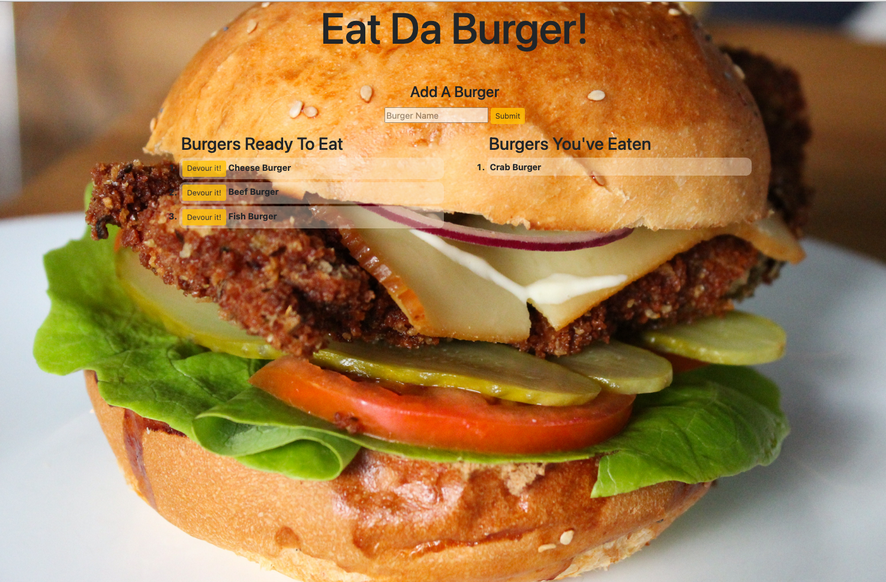

# Node Express Handlebars

## Description
In this assignment,I created a burger logger with MySQL, Node, Express, Handlebars and  ORM . I  followed the MVC design pattern. Used Node and MySQL to query and route data in the app, and Handlebars to generate  HTML.

  
  
  

You can check the deployed application  [here](https://ademir-burger.herokuapp.com/) 

  

  

## Installation
The following  dependencies must be installed to run the application: 
dependencies: mysql, express, express-handlebars

  
  

## Usage
​​* Fork repository and clone onto your machine
* You should have NODE installed and run the npm install command
* Using the MySQL workbench copy and paste the schema.sql file for the tables and the seed.sql to insert data.
* In the app.js file enter your database credentials
* To start the application type "node start.js" into the command line  and run.

## License
This project is license under the MIT license.

  

My GitHub username: [alidemirbay](https://github.com/alidemirbay)
 
You can ask your questions at: alidemirbay@gmail.com